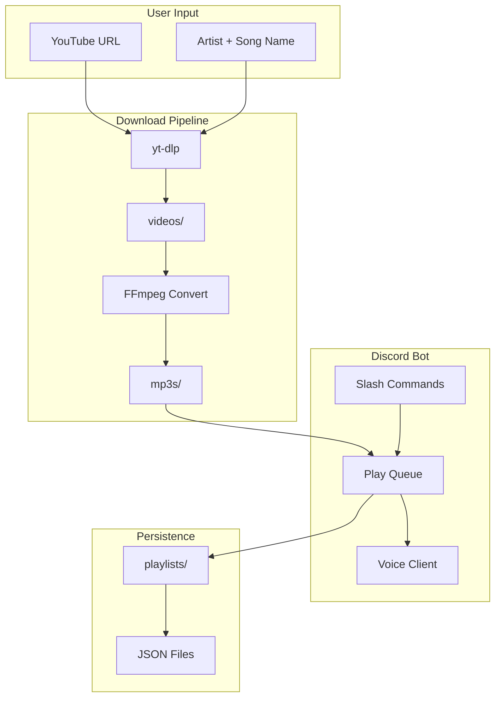

# Discord Music Bot Plan

## Architecture Overview




## Tech Stack


| Component | Choice                  | Purpose                                                     |
| --------- | ----------------------- | ----------------------------------------------------------- |
| Language  | Python 3.10+            | Discord bot ecosystem                                       |
| Discord   | discord.py (with voice) | API + voice support                                         |
| Download  | yt-dlp                  | YouTube download (yt-dlp maintained; youtube-dl deprecated) |
| Audio     | FFmpeg                  | Convert video→MP3, stream to Discord                        |
| Playlists | JSON files              | Simple, human-readable persistence                          |


**External dependencies:** FFmpeg must be installed on the system and in PATH.

---

## Virtual Environment (Portability)

All Python dependencies are installed into a project-local virtual environment so the bot is self-contained and portable across machines.

**Setup steps:**

```bash
# Create venv in project root
python -m venv venv

# Activate (Windows)
venv\Scripts\activate

# Activate (Linux/macOS)
source venv/bin/activate

# Install dependencies
pip install -r requirements.txt
```

**Project files:**

- Add `venv/` to `.gitignore` so the venv is not committed
- Include a `run.bat` (Windows) and `run.sh` (Linux/macOS) helper script that activates the venv and runs `python bot.py`, so users can double-click or `./run.sh` without manually activating
- `requirements.txt` pins versions (e.g. `discord.py>=2.3.0`, `yt-dlp>=2024.1.0`) for reproducible installs

**Portability:** Copy the project folder (excluding `venv/`, `videos/`, `mp3s/` if desired) to another machine, run `python -m venv venv` and `pip install -r requirements.txt`, add `.env` with token, and run. No global Python package pollution.

---

## Folder Structure

```
discomusicbot/
├── bot.py                 # Entry point, Discord client setup
├── config.py              # Token, paths, settings
├── requirements.txt       # Pinned deps for pip install
├── .env.example           # BOT_TOKEN placeholder
├── .gitignore             # venv/, .env, videos/, mp3s/, __pycache__/
├── run.bat                # Windows: activate venv, run bot
├── run.sh                 # Linux/macOS: activate venv, run bot
├── venv/                  # Virtual environment (create via python -m venv venv)
├── videos/                # Raw downloaded video files
├── mp3s/                  # Converted MP3 files
├── playlists/             # JSON playlist files
├── cogs/
│   ├── music.py           # Play, pause, stop, queue
│   └── playlists.py       # Playlist CRUD, save, load, play
├── services/
│   ├── downloader.py      # yt-dlp download + FFmpeg convert
│   └── player.py          # Voice playback, queue management
└── utils/
    └── helpers.py         # Search vs URL detection, path helpers
```

---

## Input Handling

**Two input modes:**

1. **YouTube URL** – Direct pass-through to yt-dlp (e.g. `https://youtube.com/watch?v=...`)
2. **Artist + Song** – Use yt-dlp search: `ytsearch1:"Artist Song Name"` to get top result

Detection logic: If input starts with `http://` or `https://` and contains `youtube`/`youtu.be`, treat as URL. Otherwise treat as search query.

---

## Download Pipeline

1. **Download video** via yt-dlp to `videos/` (e.g. `{video_id}.webm` or `.mp4`)
2. **Convert to MP3** via FFmpeg: `ffmpeg -i input.webm -vn -acodec libmp3lame output.mp3`
3. **Save MP3** to `mp3s/` with sanitized filename (e.g. `{artist}_{title}.mp3` or `{video_id}.mp3`)
4. **Cache check**: Before downloading, check if MP3 already exists in `mp3s/` (by video ID or hash) to avoid re-downloading

yt-dlp options: `-x --audio-format mp3` for direct audio extraction, or separate video download + FFmpeg convert if you need both video and MP3 storage.

---

## Voice Playback

- Use `discord.FFmpegOpusAudio` (or `FFmpegPCMAudio`) with path to MP3 file
- Connect to user's voice channel via slash command
- Implement `VoiceClient.play()`, `pause()`, `resume()`, `stop()`
- Auto-advance to next song when current finishes (use `after` callback in `play()`)

---

## Commands Summary


| Command                                | Description                                     |
| -------------------------------------- | ----------------------------------------------- |
| `/play <url_or_query>`                 | Add song to queue and play (download if needed) |
| `/pause`                               | Pause playback                                  |
| `/resume`                              | Resume playback                                 |
| `/stop`                                | Stop playback and clear queue                   |
| `/skip` or `/next`                     | Skip to next song in queue/playlist             |
| `/previous`                            | Go to previous song                             |
| `/addtoplaylist <name> <url_or_query>` | Add song to named playlist                      |
| `/removefromplaylist <name> <index>`   | Remove song at index from playlist              |
| `/createplaylist <name>`               | Create empty playlist                           |
| `/renameplaylist <old> <new>`          | Rename playlist                                 |
| `/saveplaylists`                       | Save all in-memory playlists to `playlists/`    |
| `/listplaylists`                       | List saved playlists                            |
| `/loadplaylist <name>`                 | Load and play a saved playlist                  |
| `/restartplaylist`                     | Restart current playlist from beginning         |


---

## Playlist Data Model

**In-memory:** `dict[str, list[Track]]` where `Track` has: `title`, `artist`, `url`, `video_id`, `mp3_path`, `duration`.

**On disk (JSON in `playlists/`):**

```json
{
  "name": "My Playlist",
  "tracks": [
    {
      "title": "Song Title",
      "artist": "Artist Name",
      "url": "https://youtube.com/watch?v=...",
      "video_id": "abc123",
      "mp3_path": "mp3s/artist_song.mp3"
    }
  ]
}
```

- `mp3_path` is relative to project root; validate file exists when loading
- Filename: `{sanitized_name}.json` (e.g. `my_playlist.json`)

---

## Key Implementation Details

### [services/downloader.py](services/downloader.py)

- `download_and_convert(query: str) -> Track`: Detect URL vs search, run yt-dlp, convert with FFmpeg, return Track with `mp3_path`
- Use `subprocess` or `yt_dlp` Python library
- Handle errors: invalid URL, age-restricted, unavailable

### [services/player.py](services/player.py)

- `Player` class: queue (list), current index, voice_client, playlist reference
- `play_next()`: increment index, play track at index, set `after` callback to `play_next` for auto-advance
- `play_previous()`: decrement index (min 0), play that track
- `restart_playlist()`: set index to 0, play first track

### [cogs/music.py](cogs/music.py)

- Slash commands: play, pause, resume, stop, skip, previous, restartplaylist
- Ensure user is in voice channel before playing
- Join user's channel if bot not connected

### [cogs/playlists.py](cogs/playlists.py)

- Slash commands: addtoplaylist, removefromplaylist, createplaylist, renameplaylist, saveplaylists, listplaylists, loadplaylist
- Load playlist from JSON when `loadplaylist` is called
- `saveplaylists` writes all modified playlists to `playlists/`

---

## Discord Setup Requirements

1. **Bot token** from [Discord Developer Portal](https://discord.com/developers/applications)
2. **Intents:** `GUILD_VOICE_STATES`, `GUILD_MESSAGES`, `MESSAGE_CONTENT` (if using prefix commands), `GUILDS`
3. **Privileged Gateway Intents:** Enable "Message Content Intent" if needed
4. **Invite URL:** Include `applications.commands` and `bot` scopes, `CONNECT`, `SPEAK` permissions

---

## Error Handling

- Invalid/missing YouTube URL or no search results
- FFmpeg/yt-dlp not found
- User not in voice channel
- Bot lacks permissions (Connect, Speak)
- Playlist not found when loading
- Corrupt or missing MP3 file

---

## Optional Enhancements (Out of Scope for MVP)

- Volume control
- Shuffle playlist
- Loop single track / loop playlist
- Slash command autocomplete for playlist names
- Progress bar / now playing embed

